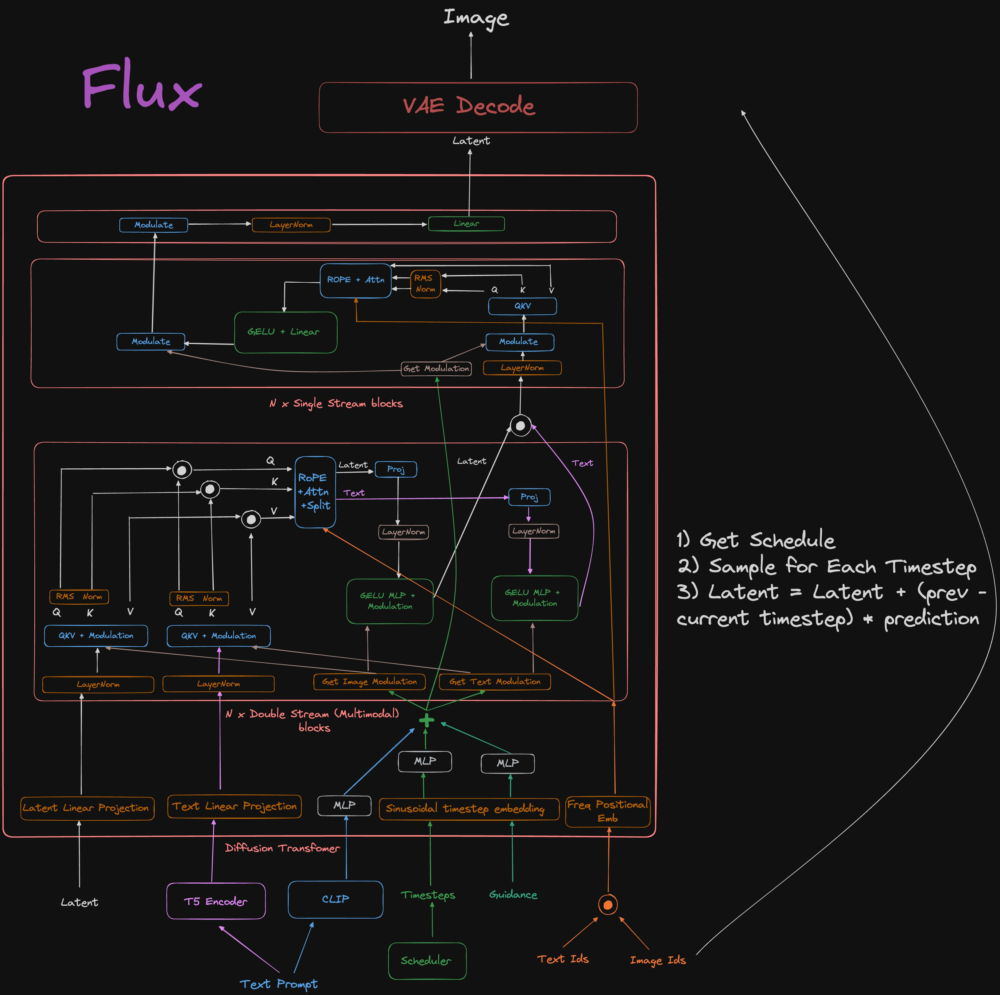

# FLUX.1 - Arquitetura

## 1. **Entrada do Usuário: Criação do Prompt**

O processo inicia quando o usuário fornece um **prompt textual** — uma descrição detalhada da imagem desejada, como por exemplo, "um gato cibernético fotorealista montado em um uniciclo". Este prompt serve como a base para todo o processo de geração de imagens.

## 2. **Codificação do Texto: Processamento do Prompt**

Assim que o prompt é recebido, ele é processado pela **seção de codificação de texto**, que utiliza dois codificadores distintos para gerar representações numéricas (embeddings) que capturam as características semânticas e contextuais do texto.

- **T5 Encoder**: Um modelo de linguagem avançado que transforma o texto em uma representação numérica. O T5 é especialmente eficaz em compreender descrições complexas e contextos linguísticos, estabelecendo uma base sólida para a geração de imagens.

- **CLIP Encoder**: O modelo CLIP (Contrastive Language–Image Pretraining) alinha representações textuais com representações visuais, gerando embeddings que capturam a relação semântica entre texto e imagem. Essa capacidade de alinhar texto e imagem é fundamental para garantir que a descrição textual fornecida pelo usuário se traduza corretamente na imagem gerada.

## 3. **Projeções Lineares e Embeddings Temporais**

Os embeddings gerados pelos codificadores são então transformados e ajustados através de projeções lineares para se integrarem ao pipeline multimodal:

- **Text Linear Projection**: Esta camada projeta os embeddings textuais em um espaço latente que é compatível com os dados visuais, facilitando a combinação harmoniosa de informações textuais e visuais.

- **Sinusoidal Timestep Embedding**: Embeddings temporais sinusoidais são adicionados para capturar a progressão temporal do processo de difusão, indicando em que estágio do processo de geração a imagem se encontra.

- **Free Positional Embedding**: Este embedding fornece informações posicionais adicionais que não seguem um padrão fixo, permitindo a modelagem de padrões espaciais complexos na imagem.

## 4. **Blocos Multimodais de Fluxo Duplo (Double Stream Blocks)**

Os embeddings textuais e visuais passam por **Double Stream Blocks**, que são responsáveis por processar informações multimodais:

- **Diffusion Transformer**: Este componente é o núcleo da arquitetura de difusão. Ele aplica atenção cruzada entre representações textuais e visuais para assegurar que cada aspecto do texto influencie a formação da imagem de maneira precisa.

- **MLP (Multilayer Perceptron)**: Utilizados dentro desses blocos para ajustar e refinar ainda mais as representações latentes, capturando relações complexas entre o texto e os dados visuais.

Esses blocos são repetidos várias vezes (N iterações) para refinar as representações e melhorar a qualidade da imagem final.

## 5. **Blocos de Fluxo Único (Single Stream Blocks)**

Após o processamento multimodal, as representações latentes são refinadas nos **Single Stream Blocks**:

- **GELU + Linear**: Combinações de ativação GELU (Gaussian Error Linear Unit) e camadas lineares ajudam a modelar não linearidades nos dados, capturando variações sutis na imagem gerada.

- **RMS Norm + Modulate**: A normalização RMS e a modulação ajustam e estabilizam o sinal, garantindo que as representações fiquem dentro dos limites numéricos adequados e que variações nos dados sejam adequadamente moduladas.

- **Self Attention**: Permite ao modelo focar simultaneamente em diferentes partes das representações textuais e latentes, capturando dependências de longo alcance nos dados.

## 6. **Projeção Latente e Decodificação**

Os dados processados são então projetados para a dimensão final necessária para a geração da imagem:

- **Latent Linear Projection**: Esta projeção ajusta os dados latentes para serem compatíveis com o decodificador VAE (Variational Autoencoder).

## 7. **Decodificador VAE: Geração da Imagem Final**

O **VAE Decoder** reconstrói a imagem a partir do espaço latente ajustado. O decodificador utiliza as informações latentes para gerar a imagem final que reflete fielmente o prompt textual fornecido pelo usuário.

## 8. **Saída: Imagem Gerada**

O processo culmina na geração da imagem, que é uma interpretação visual do prompt textual dado pelo usuário. A imagem final representa a fusão de todas as etapas anteriores, capturando tanto a complexidade linguística quanto as nuances visuais.

## Diagrama de Arquitetura

Este fluxo detalhado demonstra como o FLUX.1 combina técnicas avançadas de aprendizado de máquina para transformar descrições textuais em imagens de alta qualidade, integrando compreensão semântica e visual em cada etapa do processo.

